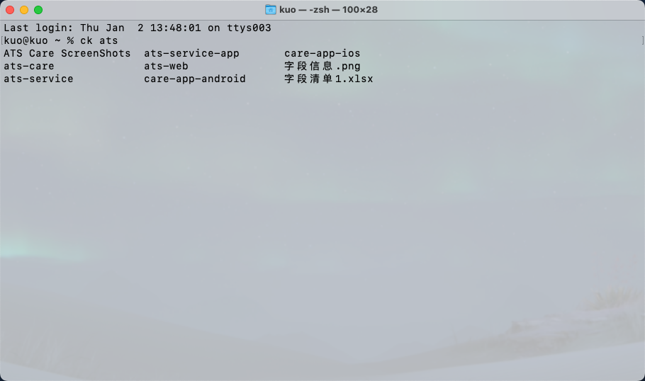
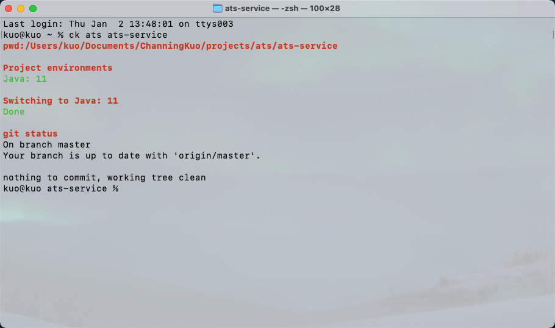

# cd命令扩展
快速cd到项目目录, 并执行环境初始化
- 初始化环境依赖conda和环境配置文件(kuo.env), 不同的环境通过切换conda环境来满足

## 使用示例
<div align="center">
    
    
    
    
</div>

## 使用方法
在.zshrc文件中添加如下内容
```
# 通用直达命令
source ~/your_path/cd_extensions/_ck.zsh
alias cdk='source ~/your_path/cd_extensions/kuo_cd_hook.sh'
```